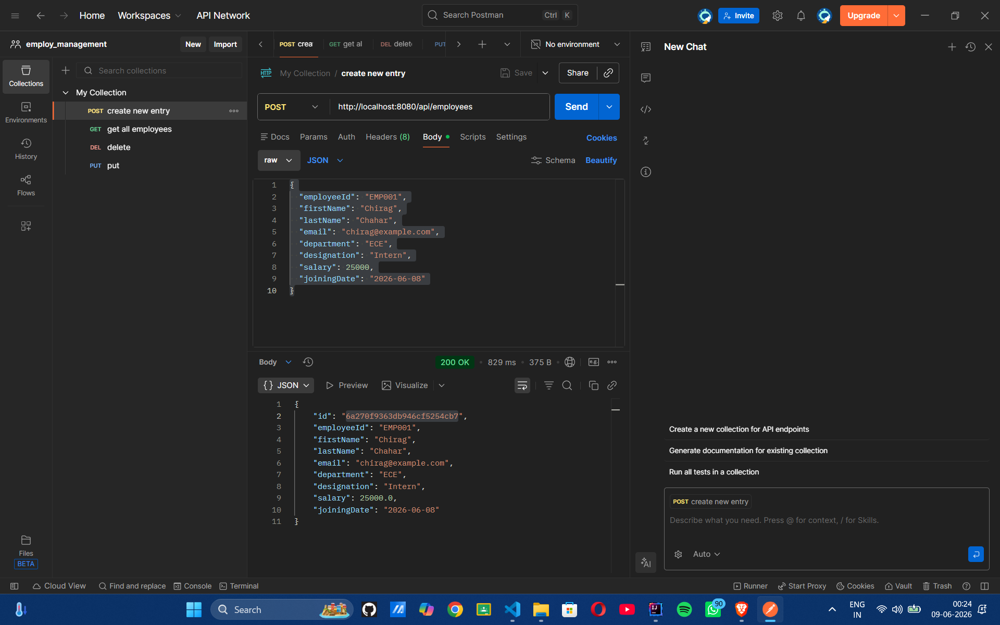
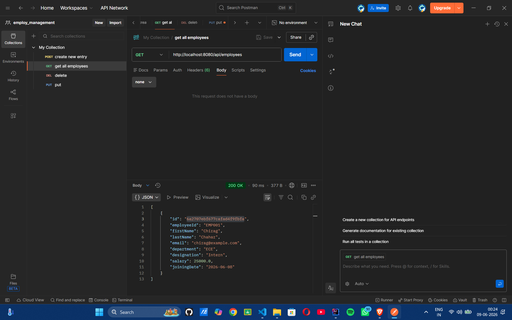
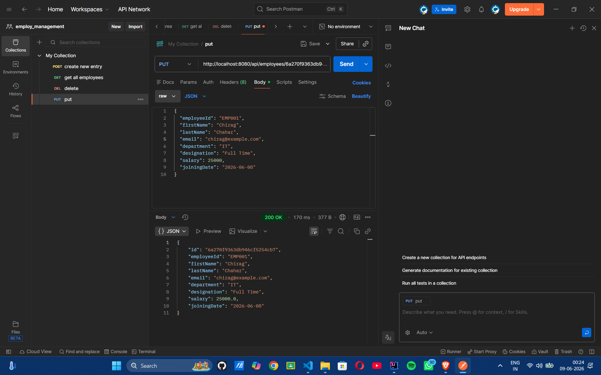
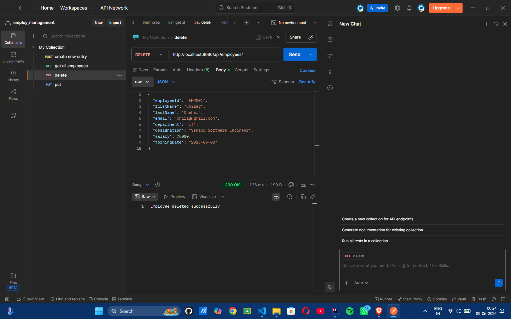

# Employee Management System

This is a simple Employee Management System developed using Spring Boot and MongoDB Atlas. The project provides REST APIs to perform CRUD (Create, Read, Update and Delete) operations on employee records.

## Technologies Used

- Java 17
- Spring Boot
- MongoDB Atlas
- Spring Data MongoDB
- Maven
- Lombok
- Postman

## Project Overview

The application allows users to manage employee information such as employee ID, name, email, department, designation, salary and joining date. Employee data is stored in MongoDB Atlas and can be accessed through REST APIs.

## API Endpoints

### Create Employee

POST `/api/employees`

### Get All Employees

GET `/api/employees`

### Update Employee

PUT `/api/employees/{id}`

### Delete Employee

DELETE `/api/employees/{id}`

### Get Employee By Id
GET `/api/employees/{id}`

## Sample Employee JSON

```json
{
  "employeeId": "EMP001",
  "firstName": "Chirag",
  "lastName": "Chahar",
  "email": "chirag@example.com",
  "department": "IT",
  "designation": "Software Engineer",
  "salary": 50000,
  "joiningDate": "2026-06-08"
}
```

## Database Configuration

Update the MongoDB connection string in:

`src/main/resources/application.properties`

```properties
spring.data.mongodb.uri=YOUR_MONGODB_URI
```

## Steps to Run

1. Clone the repository
2. Open the project in IntelliJ IDEA or VS Code
3. Configure MongoDB URI in application.properties
4. Run the Spring Boot application
5. Test APIs using Postman

Application runs on:

```
http://localhost:8080
```

## What I Learned

- Building REST APIs using Spring Boot
- Working with MongoDB Atlas
- Implementing CRUD operations using Spring Data MongoDB
- Testing APIs with Postman
- Managing project version control using Git and GitHub

## Author

Chirag Chahar
